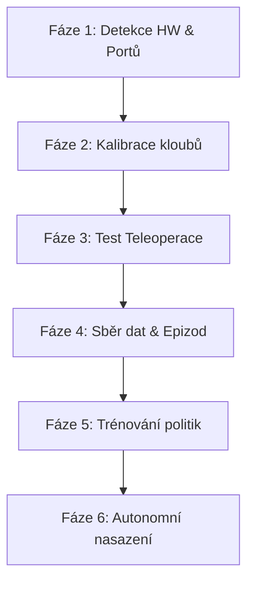

# Logický Průvodce Integrací LeRobot v Grafickém Rozhraní Orchiday OS

Tento dokument popisuje doporučený **logický postup a workflow**, jakým by měla aplikace Orchiday OS doprovázet uživatele grafickým rozhraním (GUI) krok za krokem. Cílem je plně nahradit nutnost psát příkazy v terminálu přívětivými vizuálními prvky (wizardy), přičemž aplikace na pozadí spouští odpovídající CLI skripty LeRobot a komunikuje s nimi.

---

## 🗺️ Přehled životního cyklu integrace
Proces je rozdělen do 6 logických fází, které kopírují přirozený postup vývoje robotické dovednosti:



---

## Fáze 1: Hardwarová Detekce & Výběr Portů (Krok 1/6)
Uživatel poprvé spouští Orchiday OS a připojuje hardware (řídicí desky Feetech/Dynamixel a USB kamery).

### 🛠️ Jak to funguje v GUI:
1.  **Sériové porty (Leader & Follower desky):**
    *   *Terminálový ekvivalent:* `ls -l /dev/ttyACM*` nebo `python -m serial.tools.list_ports`
    *   *Vizuální chování:* Rozbalovací menu (Select) pro "Leader Port" a "Follower Port". Aplikace provádí automatický sken a porty nabízí. Obsahuje tlačítko **"Obnovit"** pro znovunačtení portů.
2.  **USB Kamery (Náhledy a role):**
    *   *Terminálový ekvivalent:* `v4l2-ctl --list-devices`
    *   *Vizuální chování:* Blok "Náhledy USB kamer". Umožňuje přidat kameru, přiřadit jí index (0, 1, 2) a vybrat roli (`overhead` / `wrist` / `side`). Okamžitě zobrazí statický snímek nebo FPS stream jako vizuální potvrzení funkčnosti.
3.  **Prevence chyb v tomto kroku:**
    *   Pokud uživatel vybere stejný port pro obě ramena, rozhraní zobrazí varování.
    *   Aplikace automaticky doporučí zaškrtnout rozlišení `640x480` a MJPEG kodek, aby se předešlo selhání USB sběrnice (`No space left on device`).

---

## Fáze 2: Průvodce Kalibrací Ramen (Krok 2/6)
Bez správné kalibrace nelze teleoperovat ani autonomně nahrávat. Kalibrace se provádí jednou pro každé fyzické rameno.

### 🛠️ Jak to funguje v GUI:
1.  Uživatel zadá nebo vybere **`robot.id`** (např. `so100_follower_arm`) a stiskne **"Kalibrovat Follower"**.
2.  **Průvodce kalibrací (Krokový asistent):**
    *   *Terminálový ekvivalent:* Spuštění `python lerobot/scripts/calibrate.py --robot.type=so100 --robot.id=so100_follower_arm`
    *   *Vizuální chování:* Místo terminálu se otevře interaktivní dialog. Aplikace uživatele instruuje:
        *   *Krok 2.1:* *"Uvolněte rameno a nastavte ho do zcela narovnané vzpřímené polohy (nula)."* -> Uživatel to provede a klikne na tlačítko **"Potvrdit nulovou pozici"**.
        *   *Krok 2.2:* *"Otočte všemi klouby do jejich maximálních poloh..."* -> Uživatel to provede a stiskne **"Uložit limity"**.
    *   *Komunikace na pozadí:* Orchiday OS simuluje stisky kláves `Enter` / `y` a posílá je do stdin běžícího Python procesu.
3.  **Výstup a potvrzení:**
    *   Po dokončení se zobrazí zelený stav **"Zkalibrováno"** a na disku se vytvoří soubor `~/.cache/huggingface/lerobot/calibration/robots/so100/so100_follower_arm.json`.

---

## Fáze 3: Testovací Teleoperace & E-STOP (Krok 3/6)
Před nahráváním demonstrací musí uživatel fyzicky vyzkoušet bilaterální pohyb ramen k ověření přesnosti (Sanity Check).

### 🛠️ Jak to funguje v GUI:
1.  Tlačítko **"Spustit Teleoperaci"** se zaktivuje **AŽ** po úspěšném dokončení Fáze 2 (zkalibrována obou ramen).
2.  *Terminálový ekvivalent:*
    ```bash
    python lerobot/scripts/control_robot.py teleoperate \
      --robot.type=so100 --robot.id=so100_follower_arm \
      --teleop.type=so100_leader --teleop.id=so100_leader_arm
    ```
3.  **Vizuální chování během běhu:**
    *   Spustí se točivý moment motorů. Leader se stane pasivním ovladačem, Follower kopíruje jeho pohyb.
    *   V rozhraní bliká zelený indikátor **"TELEOP AKTIVNÍ"**, zobrazuje se aktuální snímková frekvence smyčky (např. `30 FPS`).
4.  **Bezpečnostní prvek — E-STOP (Emergency Stop):**
    *   Velké, červeně svítící tlačítko **"Nouzové Zastavení (E-STOP)"**.
    *   Při stisku aplikace okamžitě vyšle signál `SIGKILL` (`process.kill()`) běžícímu Python skriptu, což okamžitě odpojí napájení motorů (Torque OFF) a zabrání kolizi nebo poškození.

---

## Fáze 4: Hierarchie Dovedností & Sběr Dat (Krok 4/6)
Uživatel tvoří hierarchickou strukturu dovedností (Makro cíle a dílčí mikro akce) a natáčí pro ně jednotlivé demonstrace (epizody).

### 🛠️ Jak to funguje v GUI:
1.  **Strom dovedností (Skills Tree):**
    *   Uživatel vytvoří hlavní dovednost: `Dovednost: Úklid stolu`
    *   Pod ní vytvoří mikro-kroky: `Krok 1: uchop_kostku`, `Krok 2: presun_nad_misku`, `Krok 3: otevri_kleste`.
    *   Cesta pro ukládání dat se automaticky vygeneruje jako: `local/uklid_stolu/uchop_kostku`.
2.  **Záznamový panel (Live Record Wizard):**
    *   *Terminálový ekvivalent:*
        ```bash
        python lerobot/scripts/control_robot.py record \
          --control.repo_id=local/uklid_stolu/uchop_kostku \
          --control.num_episodes=50 --control.episode_time_s=15
        ```
    *   *Vizuální chování:* Uživatel klikne na **"Spustit Nahrávání"**. Panel se přepne do exkluzivního režimu:
        *   Zobrazí se stav: **READY (Připravte scénu a stiskněte tlačítko nebo Šipku vpravo)**.
        *   Stav **RECORDING (Nahrává se)** — na obrazovce svítí červený bod a běží odpočet v sekundách (např. 15s).
3.  **Tlačítka pro řízení epizod:**
    *   **Tlačítko "Uložit Epizodu"** (šipka `→`): Uloží právě dokončenou trajektorii a přejde k přípravě další.
    *   **Tlačítko "Zahodit & Znovu"** (šipka `←`): Okamžitě smaže nepovedenou epizodu a umožní její znovunatočení (předchází ukládání chyb operátora!).
    *   **Tlačítko "Dokončit a Zavřít"** (`ESC`): Ukončí celý záznam a zkompiluje dataset.
4.  **Manažer Epizod (Replay):**
    *   Uživatel vidí seznam nahraných pokusů: `Epizoda 0`, `Epizoda 1`...
    *   U každé epizody má tlačítka:
        *   **"▶ Přehrát"** (spustí `visualize_dataset.py --episode_index=X` v Rerun vizualizéru).
        *   **"🗑 Smazat"** (vymaže nechtěnou epizodu ze složky).

---

## Fáze 5: Trénovací Dashboard (Krok 5/6)
Jakmile má uživatel nasbíraný dostatek epizod (např. 30–50), přejde k natrénování neuronové sítě, která se stane motorickým mozkem pro danou dovednost.

### 🛠️ Jak to funguje v GUI:
1.  **Vizuální konfigurace tréninku:**
    *   *Výběr Datasetu:* Automaticky vybrán ze stromu dovedností (`local/uklid_stolu/uchop_kostku`).
    *   *Výběr Politik:* Dropdown s možnostmi `Diffusion Policy` (doporučeno pro robustnost) / `ACT` (doporučeno pro přesnou trajektorii).
    *   *Výběr Zařízení:* Detekuje CUDA/MPS/CPU.
    *   *WandB logování:* Přepínač s možností jednorázového zadání API klíče.
2.  **Průběh trénování (Live Telemetry):**
    *   *Terminálový ekvivalent:* Spuštění `python lerobot/scripts/train.py` a sledování stovek řádků textového logu loss hodnot.
    *   *Vizuální chování:* 
        *   Aplikace parsuje výstupní terminálové řádky a filtruje hodnoty `Loss` a `Epoch`.
        *   **Loss Graf:** Vykresluje se dynamický, plynule se aktualizující čárový graf klesající chyby (Loss) v čase.
        *   **Progress bar:** Ukazuje procentuální splnění (např. `Epocha 45 / 100`).

---

## Fáze 6: Autonomní Třímodelové Nasazení (Krok 6/6)
Uživatel nasadí natrénovaný model politiky a spustí kompletní autonomní orchestraci (CEO Plánovač -> VLM Inspektor -> LeRobot Svaly).

### 🛠️ Jak to funguje v GUI:
1.  **CEO Plánovač (Vysoká úroveň):**
    *   Uživatel napíše: *"Uchop kostku a polož ji do misky"*.
    *   LLM Planner (CEO) příkaz zanalyzuje a rozloží ho do vizualizované pipeline kroků: `Krok 1: uchop_kostku` -> `Krok 2: presun_nad_misku` -> `Krok 3: otevri_kleste`.
2.  **VLM Inspektor (Střední úroveň):**
    *   Inspektor pořídí snímek z kamery, vizuálně zhodnotí scénu a zkontroluje splnění předpokladů (např. *"Kostka je přítomna na stole: ANO"*).
3.  **LeRobot Worker (Nízká úroveň - Svaly):**
    *   Jakmile VLM uvolní zámek, aplikace spustí na pozadí autonomní inferenční příkaz:
        ```bash
        python lerobot/scripts/control_robot.py evaluate \
          --robot.type=so100 --robot.id=so100_follower_arm \
          --control.policy_path=outputs/training/so100_uchop_kostku/checkpoints/last/policy.pth
        ```
    *   Robot autonomně vykoná akci. VLM Inspektor ověří výsledek (kostka je v kleštích) a předá řízení dalšímu kroku v pipeline.
